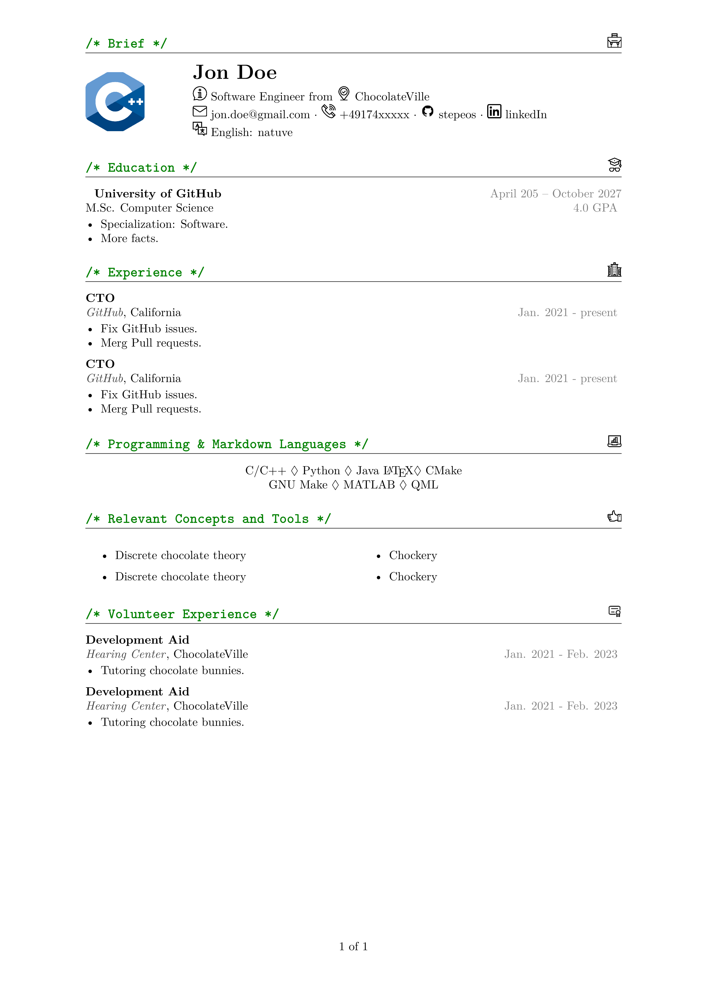

# 🧑‍💻 software-dev-latex-resume

A clean, modern LaTeX class for creating software development resumes. It uses plain formatting, profile image support, icons, and structured commands to generate a PDF resume with minimal effort.

This template is built as a `.cls` (LaTeX class) file to keep your resume logic separate from the design. Designed for tech professionals who value clarity and customization.



## ✨ Features

- 📦 Preloaded modern LaTeX packages
- 🎨 Section headers with icons
- 🖼 Optional profile picture
- 🔗 Conditional display of GitHub, LinkedIn, and languages
- 📐 A4 layout with proper margins
- 📄 Built-in resume sections:
  - Header with contact info
  - Education
  - Work experience
  - Programming languages & tools
  - Volunteer experience

## 📁 Folder Structure
```
software-dev-latex-resume/
├── resume.cls # The LaTeX class file
├── example.tex # Sample usage
├── icons/ # PNG icon set (GitHub, LinkedIn, etc.)
├── headshot.png # profile image
└── README.md
```
## 🛠 Getting Started

1. **Clone the repo**:
   ```bash
   git clone https://github.com/yourusername/software-dev-latex-resume.git
   cd software-dev-latex-resume
2. Place icons in an icons/ folder (Make sure filenames match those referenced in the class file.):
  github.png
  linkedin.png
  email.png
  telephone.png
  placeholder.png
  briefcase.png, mortarboard.png, etc. (you can download them from https://uxwing.com)
3. Edit main.tex to customize your resume content.
4. Compile your resume (requires XeLaTeX or LuaLaTeX for fontspec)
